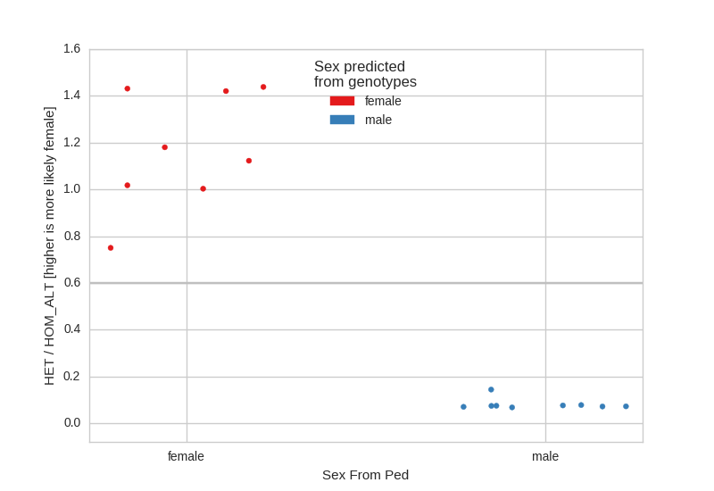
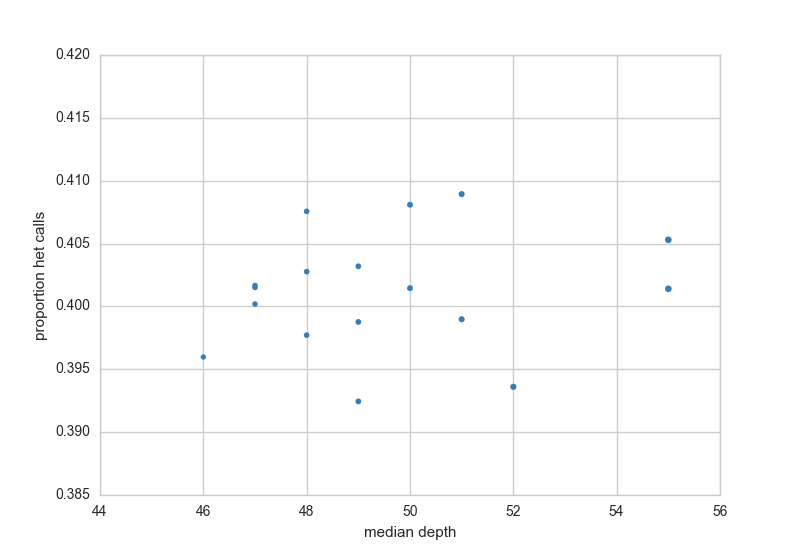
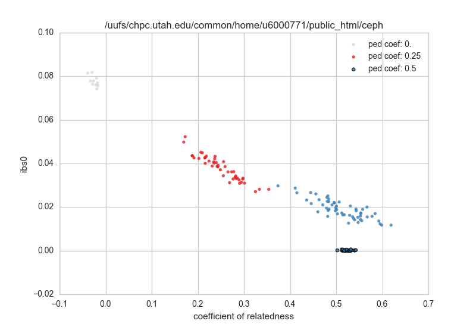

manipulation, validation and exploration of pedigrees
=====================================================

peddy compares familial-relationships and sexes as reported in a `PED file <http://pngu.mgh.harvard.edu/~purcell/plink/data.shtml#ped)>`_
with those inferred from a VCF.

It samples the VCF at about 25000 sites (plus chrX) to accurately estimate **relatedness**, **IBS0**, **heterozygosity**, **sex** and **ancestry**. It uses 2504 thousand genome samples as backgrounds to calibrate the relatedness calculation and to make ancestry predictions.

It does this very quickly by sampling, by using C for computationally intensive parts, and by parallelization.

The command-line usage looks like:

.. code-block:: bash

    python -m peddy -p 12 --plot --prefix ceph-1463 ceph1463.vcf.gz ceph1463.ped

This will use 12 cpus to run various checks and create `ceph-1463.html <_static/ceph.html>`_ which
you can open in any browser to interactively explore your data.

It will also create create 4 csv files and 4 static QC plots that mirror those in the interactive html.
These will indicate:

+ discrepancies between ped-reported and genotype-inferred relations
+ discrepancies between ped-reported and genotype-inferred sex
+ samples with higher levels of HET calls, lower depth, or more variance in b-allele-frequency (ref / (ref + alt )) for het calls.
+ an ancestry prediction based on projection onto the thousand genomes principal components

Finally, it will create a new file ped file `ceph1463.peddy.ped` that also lists
the most useful columns from the `het-check` and `sex-check`. Users can **first
look at this extended ped file for an overview of likely problems**.

Static Images
-------------

This will create a number of images:

Sex Check
+++++++++

A sex-check assumes that males should have very few heterozygote calls on the X-
chromosome and females should have relatively many. Here, we see, as expected
that there are no sex issues in the CEPH cohort:

Het Check
+++++++++

The het check looks for samples with higher rates of het calls, usually, this
can indicate sample contamination. This plot also shows depth along the X-axis
as a way to quickly check for samples with lower coverage.

Ancestry Check
++++++++++++++

Since we know the ancestry of the thousand genomes samples
we can project the current peddy input (in this case CEPH)
onto the principal components of the thousand genomes samples
and then predict the ancestry of incoming samples:

.. image:: _static/ceph.pca_check.png

Note that, as expected all of the members of the CEPH pedigree
are of 'EUR'opean descent.

Relatedness Check
+++++++++++++++++

In this check, we compare the relatedness specified in the pedigree
file to what is observed by the genotypes. For example, a sib-sib
pair should have a relatedness coefficient of 0.5. In the plot,
**sample-pairs are *colored* according to their expected relatedness
specified in the ped file and *located* in the plot according to their
relatedness (and IBS0) calculated from the genotypes**

IBS0 is the proportion of sites for which the 2 samples shared 0 alleles.
For parent-child pairs and IBS0 event is a (putative) *de novo* and so should
happen very infrequently. Unrelated samples should have a relatedness of 0
and a higher IBS0.

CSVs
++++

For each of those images, there is a corresponding `.csv` file.

The `sex-check` file will look like::

    error   het_count   het_ratio   hom_alt_count   hom_ref_count   ped_sex predicted_sex   sample
    FALSE   27056   0.1263089096893163  86640   127565  male    male    NA12877
    FALSE   103578  0.7371260212360158  48197   92319   female  female  NA12878
    FALSE   99578   0.7035623949015785  50029   91505   female  female  NA12879
    FALSE   98933   0.6946225083727102  51852   90575   female  female  NA12880
    FALSE   97733   0.6820833856762001  51843   91443   female  female  NA12881
    FALSE   25568   0.11903775333001225 85114   129675  male    male    NA12882
    FALSE   25740   0.12030398489423158 82830   131128  male    male    NA12883
    FALSE   26380   0.12349609100697533 84861   128749  male    male    NA12884
    FALSE   98882   0.68974609375   51608   91752   female  female  NA12885
    FALSE   27341   0.12795900219965367 85473   128197  male    male    NA12886
    FALSE   101838  0.7297442548709092  49321   90232   female  female  NA12887
    FALSE   24317   0.11512477334381199 84141   127082  male    male    NA12888
    FALSE   28980   0.13943418013856812 79538   128302  male    male    NA12889
    FALSE   100617  0.7108129874533741  48475   93077   female  female  NA12890
    FALSE   24443   0.11661792279543319 83839   125760  male    male    NA12891
    FALSE   100453  0.7119832162677459  47684   93405   female  female  NA12892
    FALSE   24774   0.11745685567987862 84482   126438  male    male    NA12893

And we can see that there are no inferred errors along with other information used to make that inference.

The `ped-check` file will contain `n_samples` \* `n_samples` number of rows like below::

    ibs0	ibs2	ibs2*	n	rel	sample_a	sample_b	pedigree_relatedness	pedigree_parents	predicted_parents	parent_error
    0.0801	0.0042	0.0165	4722	0.0245	NA12877	NA12878	0.0000	False	False	False
    0.0000	0.0125	0.0360	4723	0.5401	NA12877	NA12879	0.5000	True	True	False
    0.0000	0.0108	0.0390	4723	0.5482	NA12877	NA12880	0.5000	True	True	False
    0.0000	0.0119	0.0407	4723	0.5770	NA12877	NA12881	0.5000	True	True	False
    0.0000	0.0108	0.0351	4723	0.5448	NA12877	NA12882	0.5000	True	True	False
    0.0000	0.0112	0.0392	4723	0.5438	NA12877	NA12883	0.5000	True	True	False
    0.0000	0.0114	0.0379	4723	0.5452	NA12877	NA12884	0.5000	True	True	False
    0.0000	0.0110	0.0358	4723	0.5341	NA12877	NA12885	0.5000	True	True	False
    0.0000	0.0114	0.0390	4723	0.5597	NA12877	NA12886	0.5000	True	True	False

Using `IBS0`, we can infer the parent-child relationship of a pair of samples. If the inferred value
doesn't match the relationship in the ped file, then the `parent_error` column will be `True`.
We can see that the first line above has a high `ibs0` value (and low `rel` value) indicating it's
not expected to be a parent-child relation while the rest have low `ibs0` (and high `rel` values).

.. toctree::
   :maxdepth: 1

   html
